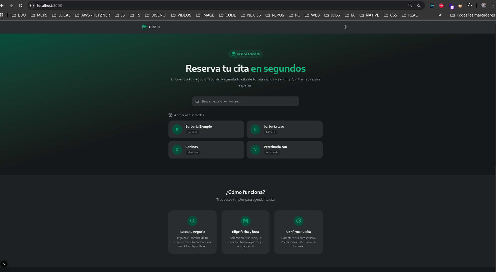
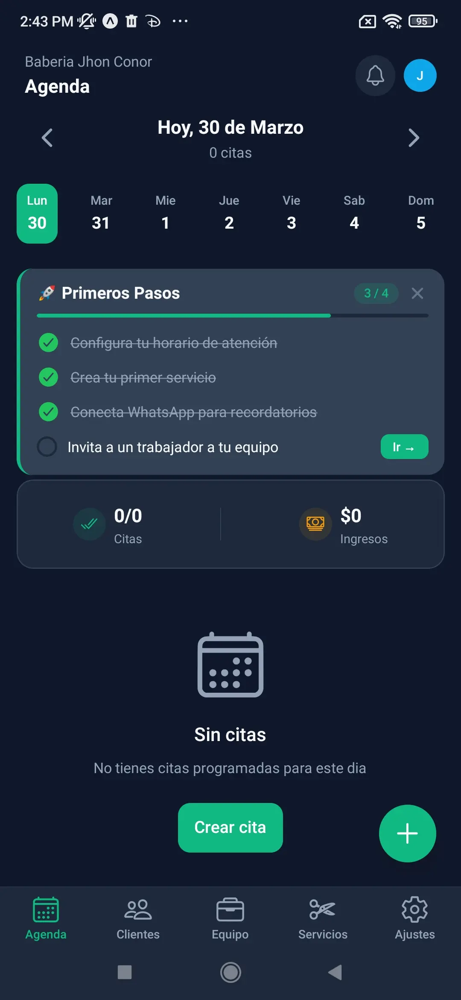
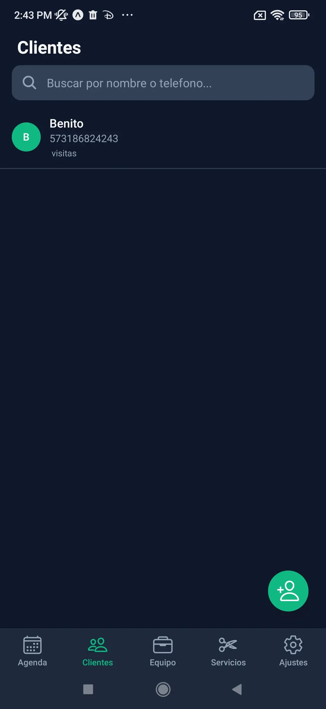
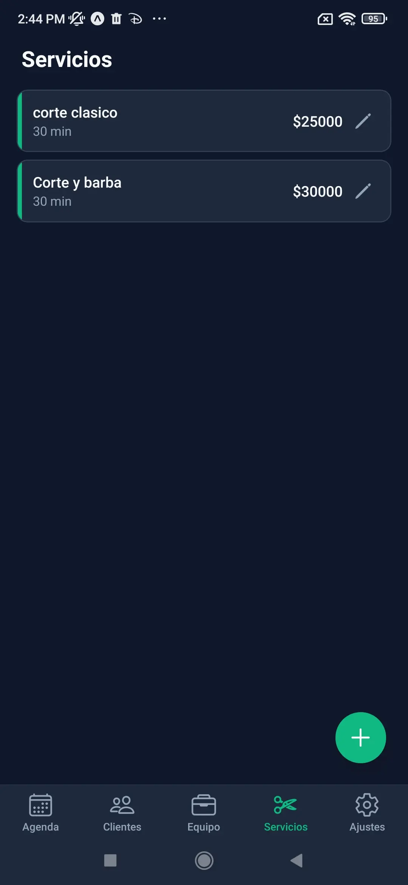
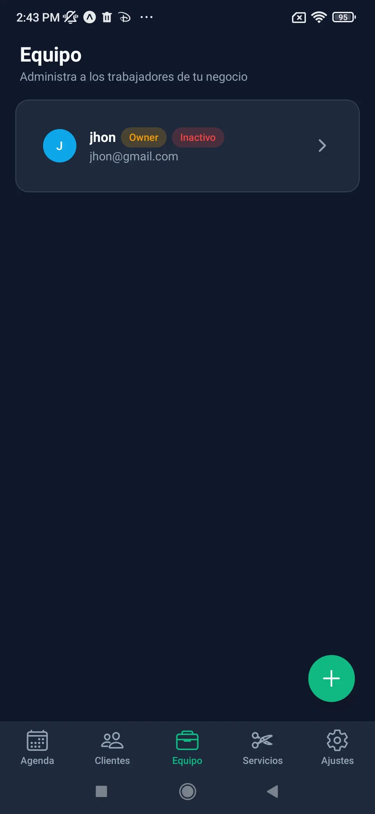
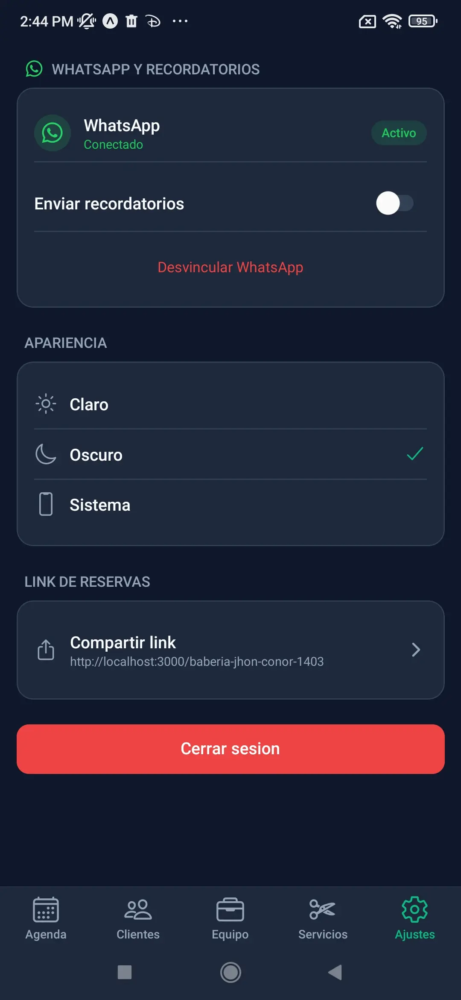
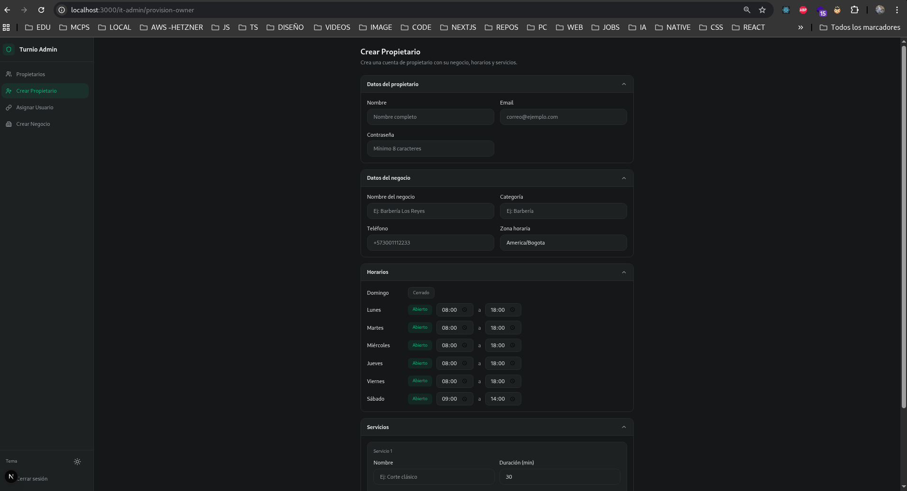
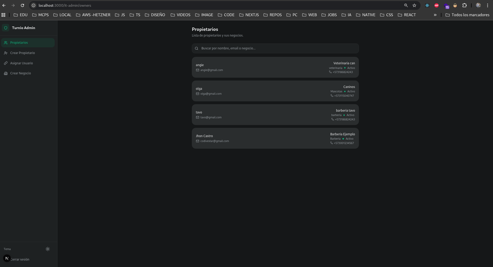
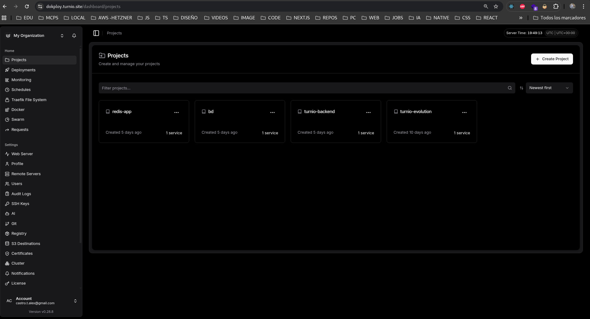
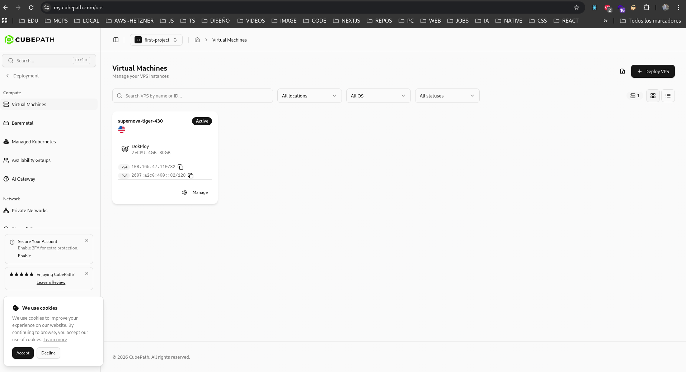

# TurnIO — Sistema de Agendamiento Inteligente

> Plataforma de reservas para negocios locales que conecta clientes con trabajadores mediante agendamiento web y notificaciones WhatsApp automatizadas.

**Demo:** [https://turnio.site](https://turnio.site)

---

## Descripción

TurnIO permite a negocios locales (barberías, veterinarias, consultorios, etc.) gestionar sus citas de forma profesional sin complicaciones.

**Flujo completo:**

1. El **administrador IT** crea el negocio desde la web y registra al dueño.
2. El **dueño (owner)** descarga la app móvil, configura su horario y conecta su WhatsApp desde Ajustes.
3. Puede agregar **trabajadores**, quienes también ingresan a la app y definen sus horarios disponibles.
4. Desde Configuración se genera un **link directo al negocio** para compartir con clientes.
5. Los **clientes** acceden a [turnio.site](https://turnio.site), buscan el negocio o usan el link directo, eligen servicio, fecha, horario e ingresan su nombre y WhatsApp.
6. El **trabajador recibe la solicitud** en la app y acepta o rechaza.
7. Al aceptar, el **cliente recibe confirmación automática por WhatsApp**.
8. Se envía un **recordatorio automático** 15 minutos (o 1 hora) antes de la cita.

Los mismos trabajadores también pueden **agendar citas desde la app** y agregar clientes manualmente.

---

## Capturas de pantalla

### Web — Agendamiento

### App Móvil

| Agenda | Clientes | Servicios |
|--------|----------|-----------|
|  |  |  |

| Equipo | Configuración |
|--------|---------------|
|  |  |

### Panel de administración IT

| Crear owner | Panel IT |
|-------------|----------|
|  |  |

### Infraestructura en CubePath

| Dokploy Deploy | CubePath |
|----------------|----------|
|  |  |

---

## Cómo se utilizó CubePath

Toda la infraestructura backend corre en una **VPS de CubePath** gestionada con **Dokploy**:

| Servicio | Tecnología | Plataforma |
|----------|-----------|------------|
| API Backend | NestJS | Dokploy (CubePath VPS) |
| Base de datos | PostgreSQL | Dokploy (CubePath VPS) |
| Mensajería WhatsApp | Evolution API | Dokploy (CubePath VPS) |
| Cache / Sesiones | Redis | Dokploy (CubePath VPS) |
| Frontend | Next.js | Vercel |

> **Nota sobre recursos:** Con los créditos de CubePath intenté desplegar también el frontend en la VPS, pero la capacidad de disco disponible no lo permitía junto con todos los servicios backend. Opté por mantener la infraestructura crítica (API, DB, WhatsApp, Redis) en CubePath y el frontend en Vercel, logrando un equilibrio óptimo sin sobrecargar el VPS.

---

## Stack tecnológico

- **Frontend:** Next.js (Vercel)
- **App Móvil:** React Native (Expo)
- **Backend:** NestJS
- **Base de datos:** PostgreSQL
- **Cache:** Redis
- **WhatsApp:** Evolution API
- **Infraestructura:** CubePath VPS + Dokploy

---

## Contacto

**Email:** castro.t.alex@gmail.com
